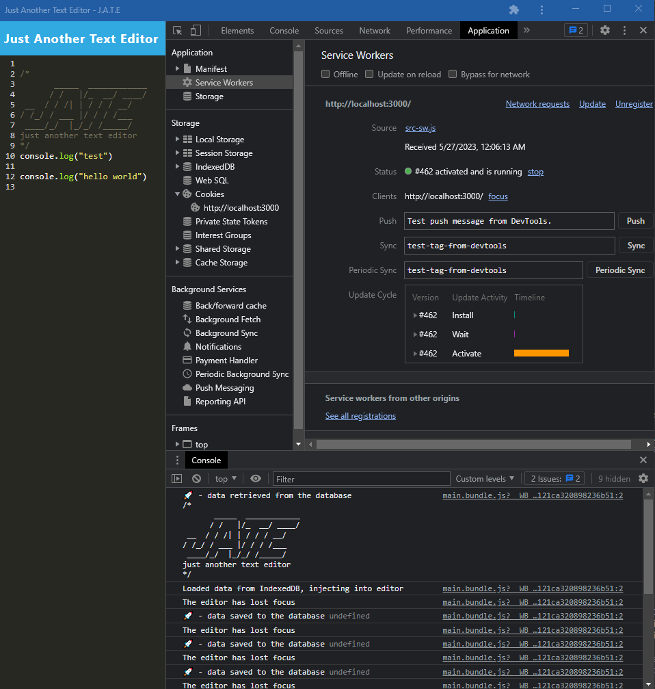

# PWA Text Editor

## Description
My motivation for this project was to become familiarized with the processes of Progressive Web Applications (PWAs) and their usefulness in caching certain app data in order to run successfully to an extent even while offline.

The ability for PWAs to cache data allows this type of technology to provide a backup on the client side even if the normal connection to a server/database is compromised in some way (i.e. offline).

I learned more about the processes behind caching data and the various node packages associated with this technology.
## Table of Contents
### [Installation](#installation)
### [Usage](#usage)
### [Screenshots](#screenshots)
### [Contributions](#contributions)
### [Tests](#tests)
### [Questions](#questions)
### [License](#license)

## Installation
This app is deployed to Heroku (link below) and is currently live.

Heroku Deployed URL: https://evening-shelf-94966.herokuapp.com/

## Screenshots

## Contributions
No outside collaborators were involved on this project.

The main third-party assets used for this project were gathered from https://github.com/galmes2u/pwa-homework-helper. This is an instructor's code repository and it was designed to help us students gain more clarity in the build process of progressive web apps, which often have a steep learning curve and can be tough to grasp given the time constraints provided.
The tutorials used to design this project include https://github.com/galmes2u/pwa-homework-helper, https://coding-boot-camp.github.io/full-stack/heroku/heroku-deployment-guide, https://developer.chrome.com/docs/workbox/.

## Questions
Please direct any further questions to: buster35 or gilb9711@gmail.com.

## License
The license used for this project is MIT: https://choosealicense.com/licenses/mit/#.
